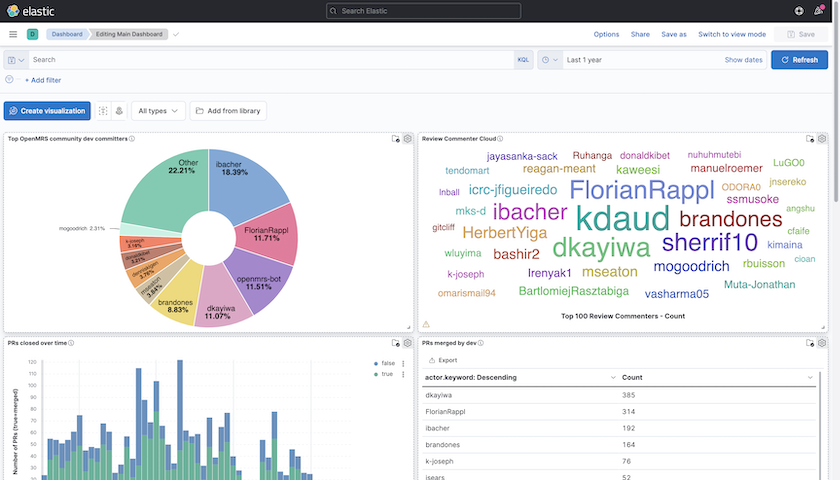

# OpenMRS Metrics

An [ELK Stack](https://www.elastic.co/what-is/elk-stack) for OpenMRS community data.



## What data?

- GitHub events (commits, pull requests, comments, etc.) since 2014 within the
  OpenMRS organization or any repository with "openmrs" in its name.

## How it works

[GitHub archive](https://www.gharchive.org/) data within
[Google Big Query](https://cloud.google.com/bigquery) are manually extracted using
a query like this:

```sql
SELECT *
FROM `githubarchive.year.*`
WHERE _TABLE_SUFFIX BETWEEN '2020' AND '2020'
AND (repo.name like '%openmrs%' OR org.login='openmrs')
```

These GitHub events by year are extracted as [newline delimited JSON](http://ndjson.org/)
files, [gzipped](https://www.gzip.org/), and stored in Google Drive.

This repository includes an ELK Stack comprising:

- **postgres** stores all the JSON events where key metrics are extracted using
  a [SQL query](postgres/docker-entrypoint-initdb.d/04-metrics.sql)
- **logstash** is used to transfer metrics from postgres into elasticsearch
- **elasticsearch** (cluster of two instances) indexes all of the metrics
- **kibana** provides a user interface for browsing and exploring the data
  within elasticsearch

## Known issues

- Extracting data from the github archive into files for this stack is a manual process
- Data only go back to 2014, because that's how far back the github archive goes
- Only events for public repositories under the OpenMRS organization or with "openmrs" in
  the repository name are included. OpenMRS-related work in GitHub outside of the OpenMRS
  organization within repositories that do _not_ have "openmrs" in the name are not
  included. This means, for example, work in Micro Frontend repositories (which chose
  to use a naming convention that does not include "openmrs") outside of the
  OpenMRS organization (e.g., by other organizations or in personal forks) are not
  included.

## Requirements

- Docker (with [docker-compose](https://docs.docker.com/compose/install/))
- 6+ GB of memory available
- Sufficient virtual memory for Docker (`sysctl -w vm.max_map_count=262144`)

**NOTE**: if you try running this stack and elasticsearch containers are exiting with
error code 137, it is because they are running out of memory. If you want, you can monitor
Docker memory usage from a terminal with `docker ps -q | xargs docker stats --no-stream`

## Running the stack

1. Clone this repository (`git clone https://github.com/bmamlin/openmrs-contrib-metrics`)
2. Within the `github-data` folder, run `./download-data.sh` to download data files
3. In the top folder, run `docker-compose up -d`
4. Wait for Kibana to show up at http://localhost:5601/

On a machine with 8 GB of memory and 4 CPUs, it takes about 10 minutes to before
all data are visible within Kibana.

**TIP**: when browsing visualizations, be sure to set your date filter to something like
"Last 10 years" to ensure you are seeing all data. The default may be set to "15
minutes", in which case you won't see any data.

## Stopping temporarily

`docker-compose pause`

(start back up with `docker-compose unpause`)

## Restarting

`docker-compose up -d`

## Stopping & cleaning up

Shut down the docker containers and clear elasticsearch volumes:

`docker-compose down -v`

Purge the postgres data:

`rm -rf pgdata`

## Reloading data

If you download new data or make changes to github files, you must clear the
`pgdata` subfolder (`rm -rf pgdata`) for data to get reloaded. If the `pgdata` 
folder contains _any_ data, postgres will not try to load any new data.

## Troubleshooting

If the stack fails to run, check the logs with:

`docker-compose logs`

If you see error message or messages of services being unreachable, scroll to 
where the errors begin. If you see a message like "max virtual memory areas 
vm.max_map_count [65530] is too low, increase to at least [262144]", then 
increase virtual memory with:

`sysctl -w vm.max_map_count=262144`

To make the change permanent, you need to edit `/etc/sysctl.conf` and set 
`vm.max_map_count` to 262144 (from [stackoverflow](https://stackoverflow.com/a/51448773/5602641)).
